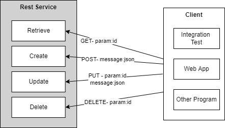

Lab - Rest Service & Jackson 
==========

Before you start
----------
The purpose of this lab is to reinforce and build upon the lecture material concerning Jackson and Rest Webservice. In this lab, you will develop rest-based webservice as shown in the figure below.



Begin by cloning this repository, then import the project onto your Eclipse. 
:octocat: :octocat: Follows the same guideline as last lab to import subproject `lab-entdev-concert` and `lab-entdev-parolee`

:sunglasses: **HINT: You may find where to complete code at TODO: in the source code**

:hugs:	**You may use Eclipse or Codespace to finish this lab. To use Codespace, click on Code->Codespace->Create Codespace on Master**

Exercise One - Make JSON support to Parolee webservice
----------
In this exercise, you will rework parolee webservice from the last lab to exchange both JSON-based and Java Serialization 
You will apply the JAX-RS framework to automate JSON marshalling and unmarshalling with Jackson.

#### (a) Create Webservice out of existing code
Please follow the steps below to modify `ParoleeApplication.java`
- Add the following line above the class declaration to specify the application path. So that when we access webservice, we can get to *http://hostname:port/services/...*
 
```java
@ApplicationPath("/services")
public class ....
```

- Add the following line inside the contructor method of this method (the method with the same name as the class)

```java
singletons.add(new ParoleeResource());
```
This line registers the `ParoleeResource` to singletons, so when client access, this resource will be provided.

That is all we need for `ParoleeApplication.java`. Please follow the steps below to modify `ParoleeResource.java`

- Add the following line side above the class declaration. These line tell the resources (So that when we access webservice, we can get to *http://hostname:port/services/concerts...*). The `Produces` and `Consumes` specify the format of message exchange to JSON.

```java
@Path("/parolees")
@Produces({MediaType.APPLICATION_JSON})
@Consumes({MediaType.APPLICATION_JSON})
```
#### Retrieve
- Make the `retrieveParolee()`: a webservice method by adding the following lines above the method declaration. This method retrieve a parolee for the client by given id

```java
@GET
@Path("{id}")
```
These annotation specify that the method will be used through *GET* verb and pass in `id` as a part of path such as *http://hostname:port/services/parolees/1*, where 1 is an id of parolee.

Please also add `@PathParam("id")` to the method signature of `retrieveConcert()` in front of `long id`.

- This method should return parolee as a result, so add the following lines (please remove `return null`).

```java
ResponseBuilder builder = Response.ok(parolee);
return builder.build();
```
#### Create
- Make `createParolee()` a webservice by adding `@POST` above method declaration.This method receive a JSON of parolee to create a new parolee. 

- The create method should return the `201` created as a return code. So please add the following lines *** Please notice that "/parolees/" have to match what is defined at @Path above the class declaration ***

```java
ResponseBuilder builder = Response.created(URI.create("/parolees/" + parolee.getId()));
return  builder.build();
```


#### Update
- Make `updateParolee()` a webservice to update parolee. This method receive a JSON of parolee and passes an id of updating parolee such as *http://hostname:port/services/parolees/1* with `PUT` verb. Add the following lines above method declaration.


```java
@PUT
@Path("{id}")
```
- Please also add `@PathParam("id")` to the method signature of `retrieveConcert()` in front of `long id`.

- the method should return 204 no content as return code, so add the following (please remove `return null`).:

```java
ResponseBuilder builder = Response.status(204);
return builder.build();
```

#### Delete
- Make `deleteParolee()` a webservice to delete a parolee with given id. Add the follwing lines above method declaration.

```java
@DELETE
@Path("{id}")
```
- Please also add `@PathParam("id")` to the method signature of `retrieveConcert()` in front of `long id`.

- This method should return 204 no content as return code, so add the lines for returning 204 as we insert for update (please remove `return null`).:


- Make `deleteAllParolees` a webservice to delete all parolee. Add `@DELETE` above method declaration. this method should return 204 no content as return code, so add the lines for returning 204 as we insert for update (please remove `return null`).:

### Date Serialization
- In Parolee.java, we want to define the format date/time of birthdate that service will use to exchange. Add the following lines above  `getDateOfBirth()` method. These two Serializer format the date/time as 'yyyy-MM-dd' such as '2011-12-03'.

```java
@JsonSerialize(using = LocalDateSerializer.class)
@JsonDeserialize(using = LocalDateDeserializer.class)
```

#### (b) Check Jackson library to project
- In lab-rest-parolee `pom.xml`, check that the Jackson dependency is added the project's POM file. The artifact you need is RESTEasy's  `resteasy-jackson2-provider`. This dependency has to be somewhere between `<dependencies>`

#### (c) Build and Run the testing 
At `lab-rest-parolee`, build and run the project with maven `verify` goal. With the  test cases supplied in `ParoleeResourceIT`, the integration tests should demonstrate that the Web service offers both Java serialization and JSON representations of resources. 

#### (d) Run and manual test
Build and run the project with maven `jetty:run` goal. Open up Postman and test the webservice. You can import the collections in postman using this link https://www.postman.com/collections/ac11e14f92fba671a235. (On Postman, Click *Import* then *Link* or *Import from link*). 

**If you use codespace, you need to replace `localhost:10000` with local address, more details [here](https://docs.github.com/en/codespaces/developing-in-codespaces/forwarding-ports-in-your-codespace)**

- Use `create` to create a new concert with POST. Add the following in the body (if not presented there)

```json
{ "firstName": "Jesse", 
   "lastName": "James", 
   "gender": "MALE", 
   "dateOfBirth": "1847-12-05"
}
```

- Use `retrieve` to retrieve a parolee. With id is 1, you should get the first parolee.
- Use `update` to update a parolee with given id such as 1
- Use `delete` to remove a parolee with given id

#### Challenge - Mismatch Attribute name
What if we want to parse json to this webservice with different attribute name. For example, `birthdate` instead of `dateOfBirth`. For example:

```json
{ "firstName": "John", 
   "lastName": "Miller", 
   "gender": "MALE", 
   "birthdate": "2007-12-05" 
}
```
Without modifying the code, the webservice return 400 Bad request. 
To resolve this, please try to put `@JsonProperty("birthdate")` at getter and setter methods in `Parolee` class (`getDateOfBirth()` and `setDateOfBirth()`). You should use Postman to test this with `create` and `retrieve` to see its effect. :eyeglasses: **Please note that the maven test unit (ParoleeResourceIT) will fail, as the test cases input `dateOfBirth`.**


Exercise Two - Make JSON support to Concert webservice
----------
In this exercise, you will rework concert webservice from the last lab to exchange both JSON-based and Java Serialization 
You will apply the JAX-RS framework to automate JSON marshalling and unmarshalling with Jackson. 

#### (a) Create Webservice out of existing code
Please follow the steps below to modify `ConcertApplication.java`
- Add the following line above the class declaration to specify the application path. So that when we access webservice, we can get to *http://hostname:port/services/...*
 
```java
@ApplicationPath("/services")
public class ....
```

- Add the following line inside the contructor method of this method (the method with the same name as the class)

```java
singletons.add(new ConcertResource());
classes.add(SerializationMessageBodyReaderAndWriter.class);
```
The first line registers the `ConcertResource` to singletons, so when client access, this resource will be provided.
The second line register the serialization for the message exchange between client to services (This supports java serialization).

That is all we need for `ConcertApplication.java`. Please follow the steps below to modify `ConcertResource.java`

- Add the following line side above the class declaration. These line tell the resources (So that when we access webservice, we can get to *http://hostname:port/services/concerts...*). The `Produces` and `Consumes` specify the format of message exchange to both JSON and Java Serialization.

```java
@Path("/concerts")
@Produces({MediaType.APPLICATION_JSON, SerializationMessageBodyReaderAndWriter.APPLICATION_JAVA_SERIALIZED_OBJECT})
@Consumes({MediaType.APPLICATION_JSON, SerializationMessageBodyReaderAndWriter.APPLICATION_JAVA_SERIALIZED_OBJECT})
```

- Make the `retrieveConcert()`: a webservice method by adding the proper annotation `@Get` and `@Path`, please look at the sample in the previous exercise. These annotation should specify that the method will be used through *GET* verb and pass in `id` as a part of path such as *http://hostname:port/services/concerts/1*, where 1 is an id of concert. 

- Please also add `@PathParam("id")` to the method signature where it needs.

- Make the `retrieveConcerts()`: a webservice method that returns many concerts by given start id and number of concerts. For example, *http://hostname:port/services/concerts?start=2&size=10* would give the concert from id:2 to id:12. It should have `@Get` and `@QueryParam` to the method signature as following:

```java
@QueryParam("start") long start, @QueryParam("size") int size
```

Finish up the following by adding `@DELETE` or `@POST` for
  - `createConcert()`: a webservice method to create a new concert by adding 
  - `deleteAllConcerts()`: a webservice method to remove all concerts


- In Concert.java, we want to define the format date/time of concert's date that service will use to exchange. Add the following lines to the getter method (such as `get...()`) of date field. These two Serializaer format the date/time as 'yyyy-MM-ddThh:mm:ss' such as '2011-12-03T10:15:30'.

```java
@JsonSerialize(using = LocalDateTimeSerializer.class)
@JsonDeserialize(using = LocalDateTimeDeserializer.class)
```


#### (b) Check Jackson library to project

- In `lab-rest-concert` 's `pom.xml`, make sure that the Jackson dependency is in the project's POM file. The artifact you need is RESTEasy's  `resteasy-jackson2-provider`. This dependency has to be somewhere between `<dependencies>`

#### (c) Build and Run the testing 

Build and run the project with maven `verify` goal. With the  test cases supplied in `ConcertResourceJavaSerializationIT` and `ConcertResourceJsonIT`, the integration tests should demonstrate that the Web service offers both Java serialization and JSON representations of resources. 


#### (d) Run and manual test
Build and run the project with maven `jetty:run` goal. Open up Postman and test the webservice. You can import the collections in postman using this link https://www.getpostman.com/collections/67f2f0bb9fb31c6af871. (On Postman, Click *Import* then *Link* or *Import from link*). 

**If you use codespace, you need to replace `localhost:10000` with local address, more details [here](https://docs.github.com/en/codespaces/developing-in-codespaces/forwarding-ports-in-your-codespace)**


- Use `create` to create a new concert with POST. Try to add several of them :eyeglasses: **(You can add one at a time)**

```json
{
	"title":"One Night of Queen",
	"date": "2021-12-03T10:15:30"
}
{
	"title":"The Selecter and the Beat",
	"date": "2022-12-15T11:15:30"
}
{
	"title":"Spend the Night with Alice Cooper",
	"date": "2022-12-23T11:15:30"
}
```

- Use `retrieve` to retrieve a concert. With id is 1, you should get the first concert.

- Use `retrieve many ` to retrieve many concert by passing param `start` and `size`. You should get several concerts as results.


#### Do not forget to Commit and Push code to github

:punch: :punch: **All Done** :punch: :punch:
