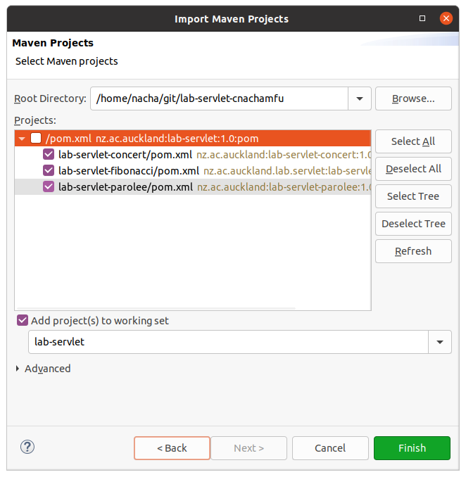
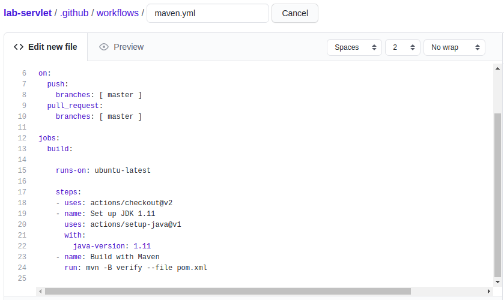

Lab - Webservice
==========

Before you start
----------
The purpose of this lab is to give you some practical experience with configuring and developing simple REST Web services. You will work with a servlet container, first directly with servlets and then with JAX-RS.


#### Import the project
Import the project into your IDE, following the same procedure in the previous lab. After you configure the parent project as a maven project, you have to import the three child projects into the workspace. In order to do this, go to import->Maven->Existing maven project. Then, select only pom files of child projects to import as shown in the figure below. 



Exercise One - Build the supplied Parolee JAX-RS application
----------
The purpose of this exercise is to practice running JAX-RS and show sample of code you will use in the next Exercise. No need to modify any code.
Project `lab-servlet-parolee` is a simple JAX-RS project. It provides a REST Web service that allows clients (consumers) to retrieve, create, update and delete parolees.

From version 3.0 of the Servlet specification, servlet containers are JAX-RS aware. This means that they automatically load the JAX-RS servlet class (`HttpServletDispatcher`) at startup time. Since you are packaging a WAR project, you still need a `web.xml` file - but it can be empty as the servlet container knows which `Servlet` class to instantiate. Hence, the `web.xml` file for this project is empty.
 
JBoss' RESTEasy implementation of JAX-RS is used, and several necessary dependencies are specified in the POM.

#### (a) Import, build and run the project
The project is complete and ready to build. Import the project into your IDE. Build and run the project, similarly to how you did for exercise one. You can run with maven'goal ` verify` to build and test the project.   

#### (b) Build and run on Standalone server
To build and manaully test the project with Jetty, run Maven with the `jetty:run` goal. This will start a jetty as a standalone web server and deploy the war file in there. You may use postman to test the services manually. You can use this link https://www.getpostman.com/collections/ac11e14f92fba671a235 to import the collection for manual testing.


#### (d) Build and run the project locally
To build and run the project, run Maven with the `jetty:run` goal. This will compile, package (generating the WAR file), and run the integration tests on the deployed Web service. The integration tests should run without error.

#### (e) Build and run the project on GitHub
On Github, you can setup a CI-CD workflow to automatically build and test your project when you push the code. TO create a workflow, go to ** Actions ** tab on your github repository and choose `Java with Maven`. Github will generate a maven.yml file and allow you to edit. You can edit the maven command on the last line to specify the maven goal to run. Also, please make sure to use Java 11 for building as maven failsafe plugin require. To test this workflow, you can push the code to your repository and see the log in the workflow tab.



Exercise Two - Develop a JAX-RS Concert service
----------
Project `lab-servlet-concert` is a partially complete JAX-RS project for a simple REST Web service that manages concerts. The project includes a skeleton Web service implementation (`ConcertResource`), an integration test (`ConcertResourceIT`), a class to represent concerts (`Concert`) and a complete POM. In `ConcertResource`, we use `concertDB` as the database to keep concert's information. This `concertDB` is simply a map of Id and concert object. The Id can be generated using `idCounter`, such as  `Long id = idCounter.incrementAndGet();`

The service is to provide the following REST interface:

- `GET /concerts/{id}`,  retrieves a `Concert` based on its unique id. The HTTP response code is either 200 or 404, depending on the existence of the required concert. As `concertDB` is a map, we can use `get()` method to fetch an item with given id.(This method is complete, please use it as a reference to implement other methods)

- `GET /concerts ? start & size`, retrieves a `List` of `Concerts` where the `start` query parameter specifies the `id` of the first concert to retrieve, and the `size` parameter is the maximum number of concerts to return (with increasing ids). This can be done by looping through `concertDB` to get the list of concert.

- `POST /concerts`, creates a new `Concert`. The HTTP request message should contain a `Concert` for which to generate an `i` and store in the Web service. The response message should have a status code of 201 and a `Location` header giving the URI of the new `Concert`.  As `concertDB` is a map, we can use `put()` method to store an item.

- `DELETE /concerts`, deletes all concerts known to the Web service. The HTTP response message's status code should be 204. All items in `concertDB` should be cleared.


**Instead of using JSON (as with the Parolee service), this service is to use Java serialization as the format for exchanging `Concert` data in HTTP request and response message bodies. In addition, the service is to track a client session using a HTTP cookie.**

#### Complete the application
Begin by importing the `lab-servlet-concert` project into your IDE. Complete the application service, implementing the necessary `Application` subclass and fleshing out the `ConcertResource` class. For `ConcertResource`, you need to add instance variables, method bodies and all metadata (JAX-RS annotations).

###### Use of Java serialization
The JAX-RS framework is extensible with respect to data formats (As discussed in the lecture). For this project, a class named `SerializedMessageBodyReaderAndWriter` is provided that plugs into the JAX-RS framework and which manages the conversion of serialized data in HTTP message bodies to `Serializable` Java objects. You don't need to be familiar with the details of this class' implementation - suffice it implements two JAX-RS interfaces `MessageBodyReader` and `MessageBodyWriter`. Any implementation of these interfaces can be registered with the JAX-RS framework to manage conversion between some format and Java objects.

The `SerializedMessageBodyReaderAndWriter` is already registered on the client-side in class `ConcertResourceIT` (see the `createClient()` method). For the server-side, you'll need to handle registration in your `Application` subclass. To do this you should override `Application`'s `getClasses()` method to return a `Set` that contains the `SerializedMessageBodyReaderAndWriter` class.

```java
private Set<Class<?>> classes = new HashSet<Class<?>>();

public ConcertApplication() {
  ...
  classes.add(SerializationMessageBodyReaderAndWriter.class);
}

@Override
public Set<Class<?>> getClasses() {
  return _classes;
}
```

When the JAX-RS runtime loads your `Application` subclass on startup, it calls both the `getSingletons()` and `getClasses()` methods. It instantiates classes obtained from `getClasses()` as necessary, and in the case of `SerializedMessageBodyReaderAndWriter`, it uses an instance to convert Java objects to and from their bytecode representations when reading and writing HTTP messages. Note that your `Application` subclass must also override `getSingletons()` to return an instance of `ConcertResource` - as discussed in lectures.

Using the registered `MessageBodyReader` and `MessageBodyWriter` support for the Java serialization format means that you don't need to manually parse and generate the payload data for the HTTP request and response messages (as with project `lab-servlet-parolee`). The `Concert` objects being exchanged between consumers and the service will automatically be converted to their byte-representation. Despite being a text-based protocol, HTTP can store binary data in HTTP message bodies.

`SerializedMessageBodyReaderAndWriter` defines a new MIME type:

- `application/java-serialization`

The client (`ConcertResourceIT`), when preparing a Web service request, specifies this as its preferred content type. Similarly, in `ConcertResource`, you should use appropriate metadata annotations to specify that methods that produce or consume content do so using this data format. As you can see in `ConcertResource`, the method signatures are written to use class `Concert` directly - unlike the `lab-servlet-parolee` project, there's no need to use stream I/O.

###### Stateless communication protocol
As discussed in class, HTTP is a stateless protocol. A JAX-RS Web service thus processes each incoming request without knowledge of earlier requests. The Concert Web service is required to track each client that is making requests of the service, and should recognise when requests are being made by the same client. Hence, each client is to be assigned a unique identity by the service, and should include this identity as part of each HTTP request.

In developing a client-tracking mechanism, you should use HTTP cookies. The first time a client sends a request to the Web service, it won't have a cookie - in which case the service should generate one and return it in the HTTP response corresponding to the request. On all subsequent invocations, the HTTP request message should contain the cookie, thereby identifying the client that made the request. You may notice that there is `Cookie clientId` in the methods of `ConcertResource`.  In a Web service that stores data for clients in a database, the cookie value could be used to retrieve data associated with the requesting client (more on the use of databases for persistence later). At the end of every methods in `ConcertResource` should create a cookie using `makeCookie`, the cookie is not yet exist. Please remember to use embed the cookie using `ResponseBuilder` as we discussed in the lecture. 

#### Github Classroom
After you finish all exercises and push the code to the repository on Github, Please check if the execution of `Github classroom workflow` runs successfully without any test fails.


#### Suggestions and resources
In developing class `ConcertResource`, you should read the JAX-RS API Javadoc, in particular for:

- `javax.ws.rs.core.Response`
- `javax.ws.rs.core.Response.Builder`
- `javax.ws.rs.core.Cookie`
- `javax.ws.rs.core.NewCookie`

Studying the `lab-servlet-parolee` project will be helpful too. In addition, have a look at the `ConcertResourceIT` class, and be sure to read the comments in the `ConcertResource` class.

Javadoc documentation for JAX-RS (which is part of Java Enterprise Edition) is available at:

- <https://docs.oracle.com/javaee/7/api/>
